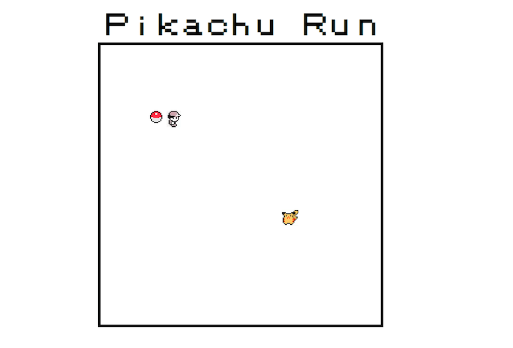

# Pikachu Run

[Live][live-link]  

[live-link]: http://judylong.xyz/PikachuRun/

[][live-link]

## About
This is a take on the classic arcade game Snake with a Pokemon theme.

## Languages
- Javascript
- jQuery
- CSS
- HTML

## Implementation Features
- Game is composed of a grid of `<li>` elements that persist on the page while classes on the `<li>` elements are updated according to gameplay using jQuery, rather than performing the more expensive operation of adding/removing DOM elements at a specific location.
- Handles user input via keybindings. Keys are mapped to appropriate actions, such that arrow keys control turning directions during gameplay and starting gameplay otherwise.
- Uses jQuery selector, .filter, .addClass and .removeClass methods to find elements and update classes, manipulating the rendering of DOM elements.
- Starts and ends game by using the .setInterval and .clearInterval methods on the window.
- Uses conditional statements to allow only 90 degree turns with respect to the player's current direction.
